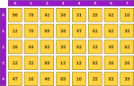
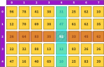
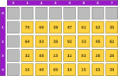
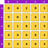
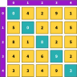
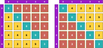

## Introducere

După ce v-ați obișnuit cu [tablourile
unidimensionale](./arrays.md), a venit timpul să
generalizăm lucrurile și pentru tablourile bidimensionale (cunoscute colocvial
ca *matrici*) și cele cu mai multe dimensiuni.

O matrice este, în esență, un vector de vectori. În memorie, matricea este
stocată astfel încât liniile să fie plasate una după alta în ordine consecutivă.

De-a lungul acestui articol, vom discuta diferite moduri de a parcurge
matricile, precum și elemente care apar des în exerciții probleme și cum să le
identificați cu ușurință în diverse contexte. Ulterior, vom discuta și tehnici
mai avansate, care pot fi utile atunci când aveți de lucrat în contexte mai
dificile, precum și tablourile multidimensionale.

## Declararea, parcurgerea și umplerea matricilor statice

În C++, matricele pot fi declarate în două moduri:

- Forma clasică, specifică limbajului C.
- Variante moderne bazate pe biblioteci din STL (abordată într-un [articol
  separat](./stl.md)).

În acest articol, ne concentrăm pe **matricile statice**, adică matrici care au
dimensiuni fixe și nu pot fi extinse.

### Declarație și structură

Pentru declararea unei matrice statice, aveți nevoie de:

1. Tipul de date al elementelor (e.g., `#!cpp int`, `#!cpp float`).
2. Dimensiunile matricei.

```cpp
--8<-- "cppintro/matrices/matrices01.cpp"
```

Aceasta definește o matrice cu 101 linii și 101 coloane, fiecare element fiind
de tip `#!cpp int`. Indicii sunt numerotați de la 0 la 100.

<figure markdown="span">
  { width="100%" loading=lazy }
  <!-- <figcaption>O matrice cu 5 rânduri și 8 coloane</figcaption> -->
</figure>

Următoarea matrice are 5 rânduri și 8 coloane și este indexată de la 0. Pentru a
accesa elementul de pe al treilea rând și a cincea coloană, folosim `#!cpp
matrice[2][4]`. Așa ar arăta pe matricea noastră:

<figure markdown="span">
  { width="100%" loading=lazy }
</figure>

!!! note "Reprezentarea matricii"

    În terminologia uzuală:

    - Liniile sunt numerotate de sus în jos.
    - Coloanele sunt numerotate de la stânga la dreapta.

    Spre deosebire de sistemul de coordonate cartezian (xOy) din geometrie, axa
    liniilor corespunde „verticalei”, iar axa coloanelor „orizontalului”. Dacă în
    matematică elementul poziționat x unități la dreapta și y unități în sus este
    $a_{x,y}$, în cazul C++ avem y unități în jos și x unități la dreapta și 
    notăm elementul cu `#!cpp a[y][x]`. Ca un ghid, țineți minte indexarea din 
    C++ ca fiind `#!cpp a[rand][coloana]`.

!!! note "Observație"

    Dacă preferați să lucrați cu indici numerotați de la 1, pur și simplu
    adăugați 1 la dimensiunile declarate și folosiți direct numărul ca atare,
    exact ca în cazul vectorilor uzuali.

    ```cpp
    --8<-- "cppintro/matrices/matrices02.cpp"
    ```

    În acel caz, matricea va fi stocată astfel:
    <figure markdown="span">
    { width="100%" loading=lazy }
    </figure>

### Parcurgere și atribuire de valori

Valorile matricei pot fi accesate și modificate similar cu variabilele
obișnuite, utilizând indicii.

```cpp
--8<-- "cppintro/matrices/matrices03.cpp"
```

Pentru a parcurge elementele, de regulă se folosesc structuri repetitive
imbricate.

!!! example "Exemplu de parcurgere și afișare"
    ```cpp
    --8<-- "cppintro/matrices/matrices04.cpp"
    ```

!!! note "Notă"

    Cea mai comună convenție este `i` pentru rând și `j` pentru coloană. Am ales
    `r` și `c` pentru că e mai simplu de reținut de la ce vin.

### Problemă exemplu - [sumapare2 de pe pbinfo](https://www.pbinfo.ro/probleme/767/sumapare2)

Problema presupune citirea unei matrice și calcularea sumei tuturor elementelor
pare din ea. Soluția poate fi implementată astfel:

```cpp
--8<-- "cppintro/matrices/matrices05.cpp"
```

!!! note "Notă"

    O altă convenție comună este `n` pentru numărul de rânduri și `m` pentru
    numărul de coloane. Dacă în matematică am avea o matrice de `m` coloane și
    `n` rânduri ca fiind de dimensiune m × n, în informatică va fi
    `#!cpp mat[n][m]`. Pentru a fi expliciți, folosim `randuri` și `coloane` în
    acest articol.

### Matrici pătratice

!!! note "Definiție"

    O matrice unde numărul de rânduri și numărul de coloane coincid se numește
    **matrice pătratică**.

În acest caz, folosim pentru ambele dimensiuni o singură variabilă. De obicei se
folosește `n`, însă în acest articol vom folosi `dim` (de la *dimensiune*). Așa
arată una:

<figure markdown="span">
  { width="100%" loading=lazy }
</figure>

Într-o matrice pătratică avem *diagonale*. Distingem două diagonale:

- **Diagonala principală** este diagonala care începe din colțul stânga-sus și
  se termină în colțul dreapta-jos.
- **Diagonala secundară** este diagonala care începe din colțul dreapta-sus și
  se termină în cel stânga-jos.

Următoarea poză arată diagonala principală a matricei de mai sus:

<figure markdown="span">
  { width="100%" loading=lazy }
</figure>

Elementele care aparțin acestei diagonale se află la (0, 0), (1, 1), (2, 2), (3,
3), (4, 4). De aici, putem deriva faptul că elementele diagonalei principale
sunt cele pentru care rândul coincide cu coloana. Asta ne permite să scriem
următorul cod care parcurge diagonala principală:

```cpp
--8<-- "cppintro/matrices/matrices06.cpp"
```

Din moment ce rândul coincide cu coloana, putem scăpa de al doilea `#!cpp for`,
pentru a obține acest cod:

```cpp
--8<-- "cppintro/matrices/matrices07.cpp"
```

Același lucru se aplică pentru indexarea de la 1, doar că va fi
`#!cpp for (int i = 1; i <= dim; ++i)`.

Pentru matricea noastră, așa va arăta diagonala secundară:

<figure markdown="span">
  { width="100%" loading=lazy }
</figure>

Elementele care aparțin acestei diagonale se află la (0, 4), (1, 3), (2, 2), (3,
1), (4, 0). Remarcăm că dacă adunăm rândul și coloana, obținem 4, care este cu
unu mai mic decât dimensiunea matricei. Asta ne permite să scriem următorul cod
care parcurge diagonala secundară:

```cpp
--8<-- "cppintro/matrices/matrices08.cpp"
```

La fel ca în cazul diagonalei principale, putem folosi un singur `#!cpp for`.
Din condiția de mai sus putem scoate `#!cpp c`. Mai exact, putem muta `#!cpp r`
în partea cealaltă pentru a obține `#!cpp c == dim - r + 1`. Acum putem scrie
codul:

```cpp
--8<-- "cppintro/matrices/matrices09.cpp"
```

Dacă matricea este indexată de la 1, atunci atât `#!cpp r`, cât și `#!cpp c` vor
avea un 1 în plus, așadar condiția devine `#!cpp r - 1 + c - 1 == dim - 1` sau
`#!cpp r + c == dim + 1`, sau `#!cpp c == dim - r + 1`. Pentru indexare de la 1,
așa va arăta codul:

```cpp
--8<-- "cppintro/matrices/matrices10.cpp"
```

Cu indexarea la 0, scădem 1, iar cu indexare de la 1, adăugăm 1.

!!! note "Observație"

    Dacă dimensiunea este impară, atunci cele două diagonale au un element
    comun. În caz contrar, diagonalele nu vor avea elemente comune.

Firește, dacă avem o diagonală, putem vorbi și despre elementele de deasupra sau
de sub ea.

Așa arată elementele de deasupra, respectiv de sub diagonala principală:

<figure markdown="span">
  { width="100%" loading=lazy  }
</figure>

Așa arată elementele de deasupra, respectiv de sub diagonala secundară:

<figure markdown="span">
  { width="100%" loading=lazy  }
</figure>

Indicii urmează următoarele reguli:

|                  |        Deasupra         |           Sub           |
| ---------------- | :---------------------: | :---------------------: |
| Diag. principală |      `#!cpp r < c`      |      `#!cpp r > c`      |
| Diag. secundară  | `#!cpp r + c < dim - 1` | `#!cpp r + c > dim - 1` |

Este ușor să țineți minte următoarea regulă: deasupra e mai mic, sub e mai mare.

Intersecția acestor regiuni formează patru regiuni: de nord, sud, vest și est.
Elementele din aceste regiuni sunt determinate de aceste condiții:

- **Nord**:
  - **Deasupra** diagonalei principale și **deasupra** diagonalei secundare.
  - **Formula**: `#!cpp r < c && r + c < dim - 1`.
- **Sud**:
  - **Sub** diagonala principală și **sub** diagonala secundară.
  - **Formula**: `#!cpp r > c && r + c > dim - 1`.
- **Vest**:
  - **Sub** diagonala principală și **deasupra** diagonalei secundare.
  - **Formula**: `#!cpp r > c && r + c < dim - 1`.
- **Est**:
  - **Deasupra** diagonalei principale și **sub** diagonala secundară.
  - **Formula**: `#!cpp r < c && r + c > dim - 1`.

### Generări de matrice

Multe probleme ce implică matrici, în special cele întâlnite la examenele de
bacalaureat și admitere, necesită generarea și construcția de matrici specifice.
În această secțiune, vom prezenta câteva exerciții și probleme rezolvate,
oferind explicații clare și optimizări acolo unde este cazul.

O listă foarte bună cu probleme suplimentare de acest tip se găsește
[aici](https://www.pbinfo.ro/?pagina=probleme-lista&tag=48).

#### Exercițiu adaptat dintr-un model al examenului de bacalaureat

!!! note "Enunț"

    Să se genereze o matrice cu dimensiunea 7 × 7 cu următoarea formă:

    ```text
    2 2 2 2 2 2 2
    2 2 2 2 2 2 2
    2 2 2 2 2 2 2
    2 2 2 2 2 2 2
    2 2 2 4 2 2 2
    2 2 4 4 4 2 2
    2 4 4 4 4 4 2
    ```

Pentru a rezolva acest exercițiu, putem observa faptul că toată matricea este
umplută cu 2, cu excepția regiunii de sud unde avem 4. La problemele de
bacalaureat de obicei indexarea este de la 1, așa că vom urma și noi această
regulă.

```cpp
--8<-- "cppintro/matrices/matrices11.cpp"
```

### Problemă exemplu - [genmat25 de pe pbinfo](https://www.pbinfo.ro/probleme/2822/genmat25)

Pentru a rezolva această problemă, trebuie să urmăm cu atenție instrucțiunile
din enunț, în ordinea în care sunt date. Ulterior, vom afișa matricea rezultată.

```cpp
--8<-- "cppintro/matrices/matrices12.cpp"
```

### Problemă exemplu - [genmat23 de pe pbinfo](https://www.pbinfo.ro/probleme/1585/genmat23)

Pentru a rezolva această problemă, vom vrea să aflăm pentru fiecare poziție
distanța față de marginea matricii și apoi vom colora pătratele cu 0 sau 1 după
caz.

```cpp
--8<-- "cppintro/matrices/matrices13.cpp"
```

#### Problemă exemplu - [zona1 de pe pbinfo](https://www.pbinfo.ro/probleme/782/zona1)

Această problemă se concentrează pe zona de sud a matricii. După ce parcurgem
elementele matricii, le vom adăuga într-un vector de frecvență pentru a obține
răspunsul cerut.

```cpp
--8<-- "cppintro/matrices/matrices14.cpp"
```

#### Problemă exemplu - [diagonal de pe nerdarena](https://www.nerdarena.ro/problema/diagonal)

Aici, vrem să ne folosim de structura matricii pentru a procesa diagonalele, de
jos în sus și de la stânga la dreapta. Mai întâi, mergem prin punctele de pe
prima coloană și apoi cele de pe prima linie, iar pentru diagonala secundară,
punctele de pe prima linie și apoi cele de pe ultima coloană. Indiferent de
parcurgere, vom merge în jos ulterior.

```cpp
--8<-- "cppintro/matrices/matrices15.cpp"
```

## Alte parcurgeri și modificări în matrice

### Parcurgerea în spirală

Parcurgerea matricii în spirală este un tip de cerință ce apare des în
problemele de informatică și este de multe ori, un tip de cerință care pun mari
dificultăți celor care vor să devină mai pricepuți la implementare.


Există foarte multe moduri de a implementa corect algoritmul de parcurgere în
spirală, dar aici ne vom concentra pe două dintre variante.

#### Varianta 1 - acoperim fiecare zonă concentrică

O primă variantă constă în a simula cele patru mutări pentru fiecare zonă
concentrică și să folosim bucle imbricate pentru a avea scrise parcurgerile.

Cu alte cuvinte, acoperim fiecare zonă colorată diferit în imaginea de mai jos
și începem mereu de pe linia și coloana i.


Aici puteți găsi implementarea din limbajul C++ a soluției pentru problema
[spirala de pe pbinfo](https://www.pbinfo.ro/probleme/211/spirala) care
folosește această tehnică.

```cpp
--8<-- "cppintro/matrices/matrices16.cpp"
```

#### Varianta 2 - folosind vectori de direcție

O variantă alternativă este aceea de a observa modul în care se execută
mișcările de către algoritmul explicat la primul pas.

Vom lua drept exemplu n = 4.

- 4 pași la dreapta
- 3 pași în jos
- 3 pași la stânga
- 2 pași în sus
- 2 pași la dreapta
- 1 pas în jos
- 1 pas la stânga

Se poate observa faptul că după ce facem primul pas și avem n mutări, lungimile
mutărilor se repetă câte două, astfel putem folosi [vectorii de
direcție](../mediu/lee.md#vectorii-de-directie) pentru a
implementa aceste mutări foarte ușor, fără mari probleme.

Aici puteți găsi implementarea din limbajul C++ a soluției pentru problema
[spirala de pe pbinfo](https://www.pbinfo.ro/probleme/211/spirala) care
folosește această tehnică.

```cpp
--8<-- "cppintro/matrices/matrices17.cpp"
```

### Transpunerea elementelor în matrice

În unele probleme, suntem nevoiți să rotim matricea pentru a lucra mai ușor cu
ea.

De obicei, cele mai frecvente rotații sunt cele la stânga sau la dreapta, dar
avem de-a face și cu alte tipuri de mișcări, precum transpozițiile sau
oglindirea valorilor.

Se poate observa faptul că după o rotire a matricii cu 90°, prima linie va
deveni prima coloană scrisă invers, a doua coloană va deveni a doua coloană
scrisă invers ș.a.m.d.

!!! note "Rotații mai mari"

    Dacă vrem să rotim matricea cu valori mai mari de 90°, putem simula rotirile
    de 90° de mai multe ori, ajungând la același rezultat.

!!! note "Rotații la dreapta"

    Dacă vrem să rotim matricea la dreapta, vom folosi aceeași logică, unde
    prima linie va deveni ultima coloană, a doua linie va deveni penultima
    coloană ș.a.m.d.

Aici se poate găsi soluția problemei [rotire de pe
pbinfo](https://www.pbinfo.ro/probleme/224/rotire), unde trebuie să rotim
matricea la stânga cu 90°.

```cpp
--8<-- "cppintro/matrices/matrices18.cpp"
```

### Bordarea unei matrici

Pentru a borda o matrice, putem să marcăm cu o valoare care să ne marcheze
faptul că nu vrem să trecem prin acele poziții (de exemplu, -1).

```cpp
--8<-- "cppintro/matrices/matrices19.cpp"
```

### Căutarea unor elemente și secvențe în matrici

Pentru a căuta elementele în matrici, vom procesa mai mult sau mai puțin ca la
vectori, putând aplica algoritmii învățați la vectori și pentru matrici.

O tehnică care merită știută este aceea că în cazul multor probleme, dacă vrem
să alegem o submatrice cu o anumită proprietate, de multe ori este optim să
fixăm linia de început și de final, iar mai apoi să procesăm valorile dintre
cele două linii presupunând că acestea formează un vector, ulterior aplicând
tehnicile și algoritmii învățați la vectori.

Un astfel de exemplu de problemă este [Submatrix
SumMax](https://www.pbinfo.ro/probleme/3410/submatrixsummax), discutată în
articolul cu secvențe.

## Tablouri multidimensionale

În general, când vine vorba de tablouri cu mai multe dimensiuni, putem să le
declarăm fie la fel cum declarăm matricile, fie folosind variantele din STL,
care vor fi detaliate în articolul corespunzător.

De exemplu, `#!cpp int v[101][101][101];` reprezintă un "cub" de dimensiuni 101
× 101 × 101. La fel ca la celelalte tablouri, cu cât avem mai multe dimensiuni,
cu atât cantitatea de memorie crește, iar în cele mai multe cazuri, nu vom avea
nevoie de mai mult de 3–4 dimensiuni.

## Concluzii

Lucrul cu matrici și tablouri multidimensionale este un pas înainte pentru
aprofundarea principiilor programării în oricare limbaj de programare. Foarte
mulți algoritmi pe matrici sunt aplicați în diverse moduri și așa cum se poate
vedea în metodele de mai sus, aplicațiile sunt foarte răspândite.

## Probleme suplimentare

- [cntlinii pbinfo](https://www.pbinfo.ro/probleme/776/cntlinii)
- [ordlin pbinfo](https://www.pbinfo.ro/probleme/771/ordlin)
- [lincol pbinfo](https://www.pbinfo.ro/probleme/669/lincol)
- [chenar pbinfo](https://www.pbinfo.ro/probleme/210/chenar)
- [zone1 pbinfo](https://www.pbinfo.ro/probleme/781/zone1)
- [serpuire pbinfo](https://www.pbinfo.ro/probleme/794/serpuire)
- [spirala1 pbinfo](https://www.pbinfo.ro/probleme/1008/spirala1)
- [spirala2 pbinfo](https://www.pbinfo.ro/probleme/1584/spirala2)
- [eroziune pbinfo](https://www.pbinfo.ro/probleme/594/eroziune)
- [memory001 pbinfo](https://www.pbinfo.ro/probleme/1444/memory001)
- [OJI 2007 cartele](https://kilonova.ro/problems/759)
- [infoarena mostenire2](https://infoarena.ro/problema/mostenire2)
- [infoarena marmote](https://www.infoarena.ro/problema/marmote)
- [Problemele recomandate în cele 4 articole de
  aici](https://cppi.sync.ro/materia/tablouri_bidimensionale_matrice.html)
- [Probleme de la parcurgerea matricelor oarecare -
  pbinfo](https://www.pbinfo.ro/probleme/categorii/47/tablouri-bidimensionale-matrice-parcurgerea-matricelor-oarecare)
- [Probleme de la parcurgerea matricelor pătratice -
  pbinfo](https://www.pbinfo.ro/probleme/categorii/80/tablouri-bidimensionale-matrice-parcurgerea-matricelor-patratice)
- [Probleme diverse cu matrici -
  pbinfo](https://www.pbinfo.ro/probleme/categorii/58/tablouri-bidimensionale-matrice-probleme-diverse)

## Resurse suplimentare

- [Tablouri bidimensionale -
  pbinfo](https://www.pbinfo.ro/articole/5620/tablouri-bidimensionale)
- [Articolele din secțiunea tablouri bidimensionale (matrice) - CPPI
  Sync](https://cppi.sync.ro/materia/tablouri_bidimensionale_matrice.html)
- [Matrici -
  InfoGym](https://events.info.uaic.ro/infogim/2021/lectii/6/12%20matrici.pdf)
- [Tablouri pătratice -
  pbinfo](https://www.pbinfo.ro/articole/5626/tablouri-patratice)
